```{r setup, include=FALSE}
knitr::opts_chunk$set(echo = TRUE)
```

## **1. Tóm tắt**

Bệnh tim mạch (CVD) là nguyên nhân gây tử vong số 1 trên toàn cầu, cướp
đi sinh mạng của khoảng 17,9 triệu người mỗi năm, chiếm 31% tổng số ca
tử vong trên toàn thế giới. Bốn trong số 5 CVD tử vong là do đau tim và
đột quỵ, và một phần ba số ca tử vong này xảy ra sớm ở những người dưới
70 tuổi. Suy tim là một sự kiện phổ biến do CVD gây ra và bộ dữ liệu này
có thể được sử dụng để dự đoán bệnh tim có thể xảy ra. Những người mắc
bệnh tim mạch hoặc những người có nguy cơ tim mạch cao (do sự hiện diện
của một hoặc nhiều yếu tố nguy cơ như tăng huyết áp, tiểu đường, tăng
lipid máu hoặc bệnh đã được thiết lập) cần được phát hiện và quản lý
sớm, trong đó mô hình học máy có thể giúp ích rất nhiều.Với những lý do
kể trên, nhóm chúng em đã quyết định chọn chủ đề "Phân tích và dự đoán
khả năng suy tim" với mục đích tìm hiểu xem liệu có những yếu tố nào ảnh
hưởng đến khả năng mắc bệnh suy tim ở con người. Sau thời gian tìm hiểu
và đi đến thống nhất, nhóm chúng em đã chọn ra những vấn đề sau để đi
vào phân tích sâu hơn: - Lượng Cholesterol cao ảnh hưởng như thế nào đến
nguy cơ mắc bệnh tim? - Nam giới có nguy cơ mắc bệnh tim cao hơn nữ giới
hay không? - Trong các yếu tố ở tập dữ liệu, đâu là những yếu tố chính
dẫn đến nguy cơ mắc bệnh tim suy tim cao hơn?\
- Nhóm chúng em đã sử dụng những phương pháp sau để nghiên cứu vấn đề:

-   EDA - Random Forest

-   Logistic Regression

-   Kiểm định ý nghĩa thống kê

-   Linear Regression

\- Một số kết quả đạt được:

-   Từ các biểu đồ và kiểm định thống kê, nhóm chúng em đã có một số
    bằng chứng để chỉ ra rằng những người có lượng Cholesterol càng cao
    thì khả năng mắc bệnh tim càng cao. Đặc biệt hơn, bình thường ta sẽ
    nghỉ khả năng mắc bệnh tim không liên quan tới giới tính. Nhưng qua
    quá trình phân tích ta có thể thấy rõ ràng rằng nam giới có nguy cơ
    mắc bệnh tim cao hơn rất nhiều so với nữ giới.

<!-- -->

-   Mô hình dự đoán suy tim sử dụng Logistic Regression cho ra kết quả
    với độ chính xác khá cao, có khi lên tới hơn 90% và hâu như là hơn
    80%.

# **2. Giới thiệu**

## 2.1 Lượng Cholesterol cao ảnh hưởng như thế nào đến nguy cơ mắc bệnh tim?

-   Lý do chọn câu hỏi: Ở người bình thường, hàm lượng cholesterol trong
    máu luôn là hằng định, chỉ khi nó tăng quá cao mới gây bệnh, gọi là
    tăng cholesterol hay là tăng mỡ máu, hiện tượng này gây xơ vữa động
    mạch, làm hẹp mạch máu và là nguyên nhân chủ yếu của bệnh tim mạch.
    Người ta có thể không cảm nhận được về tình trạng xơ vữa động mạch
    xảy ra từ từ trong cơ thể mình. Vậy lượng Cholesterol như thế nào
    thì dễ mắc bệnh tim hơn?

-   Input: lượng Cholesterol của những người tham gia khảo sát và tình
    trạng bệnh tim của họ

-   Phương pháp sử dụng: Linear Regression

-   Output: người có lượng Cholesterol càng cao thì càng có khả năng mắc
    bệnh tim

## 2.2 Nam giới có nguy cơ mắc bệnh tim cao hơn nữ giới hay không?

-   Lý do chọn câu hỏi: Bệnh tim mạch hiện nay là một trong những yếu tố
    gây tử vong hàng đầu ở cả nam giới và nữ giới. Nhìn chung, nam giới
    có nguy cơ bị đau tim nhiều hơn phụ nữ. Tuy nhiên ở phụ nữ ở thời kỳ
    mãn kinh, nguy cơ sẽ tăng cao hơn và sau tuổi 65, nguy cơ mắc bệnh
    tim mạch ở nam giới và phụ nữ là như nhau. Vậy giới tính nào sẽ có
    nguy cơ mắc bệnh tim cao hơn?

-   Input: giới tính và tình trạng bệnh tim của người tham gia khảo sát

-   Phương pháp sử dụng: Kiểm định ý nghĩa thống kê

-   Output: Nam giới có nguy cơ mắc bệnh tim cao hơn từ 28% - 47% so với
    nữ giới.

## 2.3 Trong các yếu tố ở tập dữ liệu, đâu là những yếu tố chính dẫn đến nguy cơ mắc bệnh tim suy tim cao hơn?

-   Lý do chọn câu hỏi: xem xét một cách tổng quát rằng biến nào có ảnh
    hưởng chính đến khả năng mắc bệnh suy tim bên cạnh những biến đã
    được phân tích riêng.

-   Input: tất cả các biến của tập dữ liệu

-   Phương pháp sử dụng: Random Forest

-   Output: biến ST_Slope là biến ảnh hưởng nhiều nhất tới khả năng mắc
    bệnh tim.

## 2.4 **Sử dụng mô hình Logistic Regression để dự đoán một người có khả năng bị bệnh tim hay không**

-   Lý do chọn câu hỏi: Để tìm hiểu độ chính xác của mô hình cao hay
    không.

-   Input: tất cả các biến của tập dữ liệu.

-   Phương pháp sử dụng: Logistic Regression

-   Output: Đưa ra dự đoán một người có khả năng mắc bệnh tim hay không.

# **3. Dữ liệu**

-   Dữ liệu cho cho đồ án được lấy từ website ([Heart Failure Prediction
    Dataset
    \|Kaggle](https://www.kaggle.com/datasets/fedesoriano/heart-failure-prediction?resource=download)).
-   Gồm 1 tập dữ liệu ở dạng (.csv) /heart.csv.
-   Tập dữ liệu này được tạo bằng cách kết hợp các tập dữ liệu khác nhau
    đã có sẵn một cách độc lập nhưng chưa được kết hợp trước đó. Trong
    bộ dữ liệu này, 5 bộ dữ liệu về tim được kết hợp trên 11 đặc điểm
    chung khiến nó trở thành bộ dữ liệu về bệnh tim lớn nhất có sẵn cho
    mục đích nghiên cứu cho đến nay. Năm bộ dữ liệu được sử dụng để quản
    lý nó là:
    -   Cleveland: 303 quan sát
    -   Hungarian: 294 quan sát
    -   Switzerland: 123 quan sát
    -   Long Beach VA: 200 quan sát
    -   Stalog (Heart) Data Set: 270 quan sát Tổng cộng: 1190 quan sát
        Duplicated: 272 quan sát ---\> Tập dữ liệu cuối cùng: 918 quan
        sát
-   Mọi bộ dữ liệu được sử dụng có thể được tìm thấy trong Chỉ mục bộ dữ
    liệu bệnh tim từ Kho lưu trữ Máy học UCI trên liên kết sau:
    <https://archive.ics.uci.edu/ml/machine-learning-databases/heart-disease/>
-   Biến phân loại (định tính): Sex, ChestPainType, FastingBS,
    RestingECG, ExerciseAngina, ST_Slope, HeartDisease
-   Biến số (định lượng): Age, RestingBP, Cholesterol, MaxHR, Oldpeak
-   Đọc dữ liệu đầu vào:

```{r echo=FALSE, fig.cap="", out.width = '100%'}
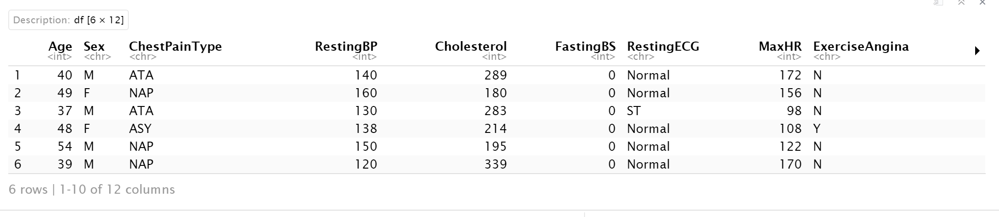
```

```{r echo=FALSE, fig.cap="", out.width = '100%'}
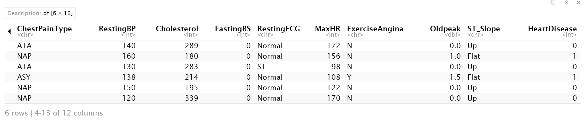
```

-   Kiểm tra dữ liệu có rỗng hay không:

```{r echo=FALSE, fig.cap="", out.width = '100%'}
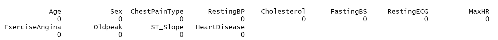
```

-   Kiểm tra dữ liệu trùng nhau:

```{r echo=FALSE, fig.cap="", out.width = '25%'}
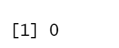
```

Không có dữ liệu trùng nhau

# **4. Trực quan hóa dữ liệu**

-   Tóm tắt tập dữ liệu:

```{r echo=FALSE, fig.cap="", out.width = '100%'}
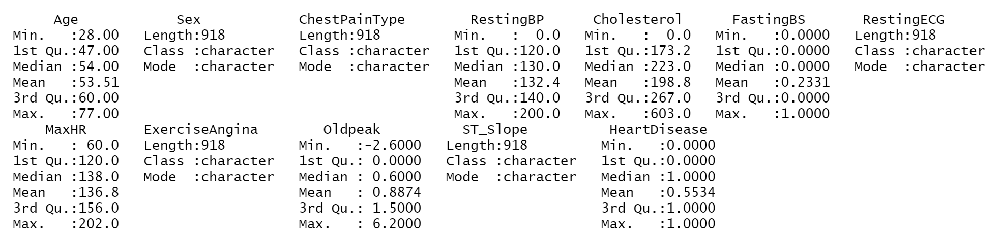
```

-   Xem cấu trúc của tập dữ liệu:

```{r echo=FALSE, fig.cap="", out.width = '100%'}
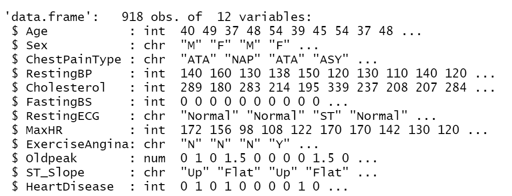
```

-   Một số thư viện dùng cho việc trực quan hóa dữ liệu

```{r}
library(tidyverse)
library(ggplot2)
library(dplyr)
```

-   Có bao nhiêu người bị và không bị bệnh tim trong tập dữ liệu?

```{r echo=FALSE, fig.cap="", out.width = '100%'}
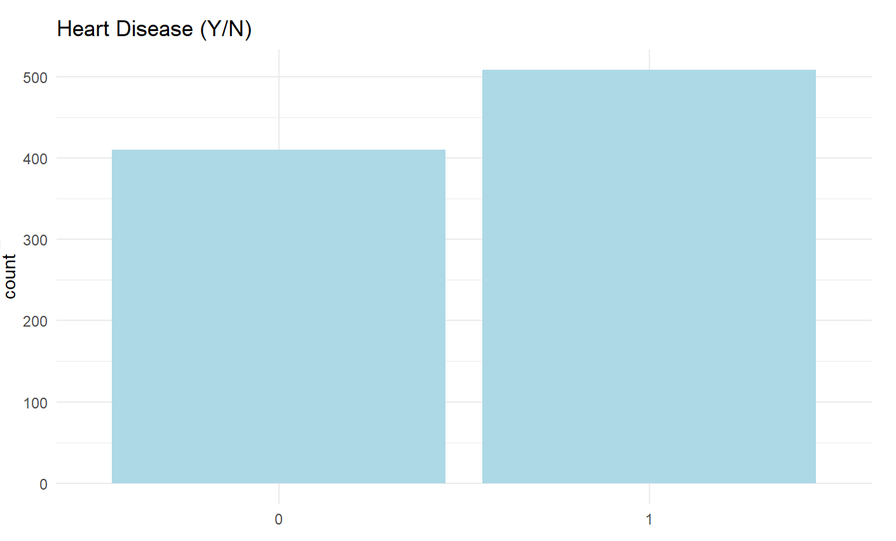
```

Từ đồ thị trên có thể thấy: Có khoảng 400 người không mắc bệnh tim và
khoảng 500 người mắc bệnh tim trong tập dữ liệu.

-   Tỉ lệ bị bệnh tim theo lượng Cholesterol

```{r echo=FALSE, fig.cap="", out.width = '100%'}
knitr::include_graphics("image/cholesterol.png")
```

Qua biểu đồ trên ta có thể thấy được rằng người có lượng Cholesteol càng
lớn thì khả năng mắc bệnh tim càng cao.

-   Tỉ lệ bị bệnh tim theo giới tính:

```{r echo=FALSE, fig.cap="", out.width = '100%'}
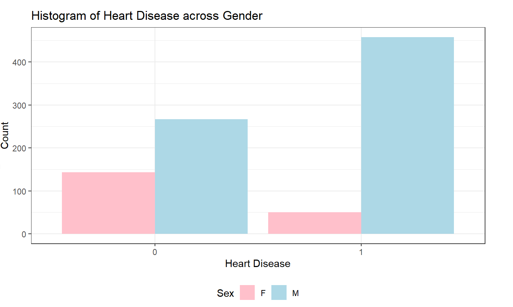
```

Số lượng nam giới bị bệnh tim cao hơn nam không bị bệnh tim, số lượng nữ
giới bị bệnh tim thấp hơn số lượng nữ không bị bệnh tim.

-   Tương quan giữa các biến trong tập dữ liệu

    ```{r echo=FALSE, fig.cap="", out.width = '75%'}
    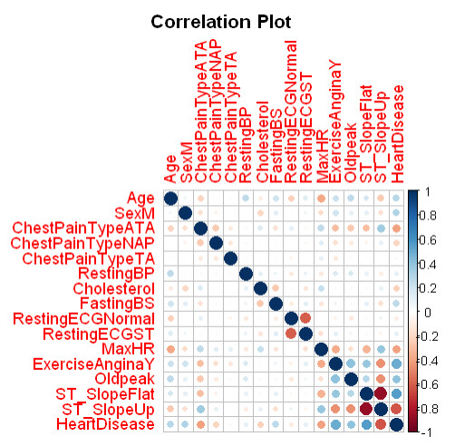
    ```

# **5. Mô hình hóa dữ liệu**

## 5.1 Random Forest

-   Random là ngẫu nhiên, Forest là rừng, nên ở thuật toán Random Forest
    mình sẽ xây dựng nhiều cây quyết định bằng thuật toán Decision Tree,
    tuy nhiên mỗi cây quyết định sẽ khác nhau (có yếu tố random). Sau đó
    kết quả dự đoán được tổng hợp từ các cây quyết định.

-   Ở bước huấn luyện thì mình sẽ xây dựng nhiều cây quyết định, các cây
    quyết định có thể khác nhau. Sau đó ở bước dự đoán, với một dữ liệu
    mới, thì ở mỗi cây quyết định mình sẽ đi từ trên xuống theo các node
    điều kiện để được các dự đoán, sau đó kết quả cuối cùng được tổng
    hợp từ kết quả của các cây quyết định.

-   Xây dựng thuật toán Random Forest:

    -   Lấy ngẫu nhiên n dữ liệu từ bộ dữ liệu với kĩ thuật
        [Bootstrapping](https://en.wikipedia.org/wiki/Bootstrapping_(statistics)),
        hay còn gọi là **random sampling with replacement**. Tức khi
        mình sample được 1 dữ liệu thì mình không bỏ dữ liệu đấy ra mà
        vẫn giữ lại trong tập dữ liệu ban đầu, rồi tiếp tục sample cho
        tới khi sample đủ n dữ liệu. Khi dùng kĩ thuật này thì tập n dữ
        liệu mới của mình có thể có những dữ liệu bị trùng nhau.

    -   Sau khi sample được n dữ liệu từ bước 1 thì mình chọn ngẫu nhiên
        ở k thuộc tính (k \< n). Giờ mình được bộ dữ liệu mới gồm n dữ
        liệu và mỗi dữ liệu có k thuộc tính.

    -   Dùng thuật toán Decision Tree để xây dựng cây quyết định với bộ
        dữ liệu ở bước 2.

## 5.2 Logistic Regression

*a. Hàm sigmoid:*

Tất cả các hàm Sigmoid đều có một đặc điểm chung. Chúng có thể chuyển
những con số đầu vào thành một phạm vi nhỏ nhất định. Cụ thể, các con số
đầu vào sẽ chuyển thành từ 0 đến 1 hoặc -1 và 1. Nghĩa là, Hàm Sigmoid
dùng để chuyển một giá trị thực thành một giá trị kiểu xác suất. Hàm
Sigmoid sẽ nhận đầu vào (input) và thực hiện những công việc sau:

-   Nếu biến đầu vào âm, hàm Sigmoid sẽ chuyển gần như tất cả thành một
    số gần với 0.

-   Với gần như tất cả đầu vào dương, hàm Sigmoid sẽ biến đầu vào thành
    một số gần với 1.

-   Trường hợp đầu vào tương đối gần 0, hàm Sigmoid sẽ biến chúng thành
    số bất kỳ từ 0 đến 1.

Công thức tổng quát:

```{r echo=FALSE, fig.cap="", out.width = '75%'}
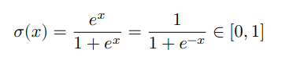
```

Minh họa về dường cong chữ S của hàm Sigmoid:

```{r echo=FALSE, fig.cap="", out.width = '75%'}
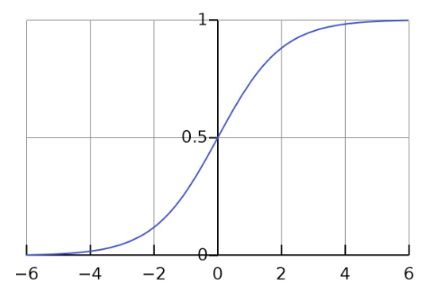
```

*b. Các bước thực hiện:*

\- Chia tập dữ liệu thành 2 phần: phần 1 để huấn luyện mô hình, phần 2
để thực hiện đánh giá mô hình logistic.

\- Kiểm tra, lọc và xóa hết các giá trị ngoại vi để tránh làm sai mô
hình.

\- Xây dựng mô hình logistic và train mô hình.

\- Đưa ra dự đoán với 'Response' là xác suất kiểm tra kết quả.

\- Xây dựng ma trận nhằm lẫn và đường ROC đánh giá mô hình.

# **6. Thực nghiệm, kết quả và thảo luận**

-   R_Square: Các biến độc lập giải thích được 53.1% sự biến thiên của
    biến phụ thuộc. Phần còn lại 46.9% được giải thích bởi các biến
    ngoài mô hình và sai số ngẫu nhiên.

    ```{r echo=FALSE, fig.cap="", out.width = '75%'}
    knitr::include_graphics("image/R_Square.jpg")
    ```

    Chỉ số R_Square \> 0.53 --\> Chỉ số này nói lên rằng mô hình tốt và
    có ý nghĩa.

-   RMSE

    ```{r echo=FALSE, fig.cap="", out.width = '75%'}
    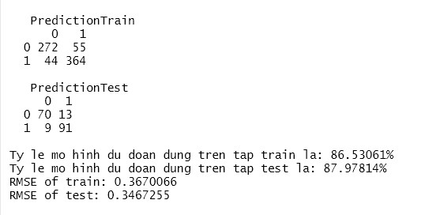
    ```

-   Random Forest

    ```{r echo=FALSE, fig.cap="", out.width = '100%'}
    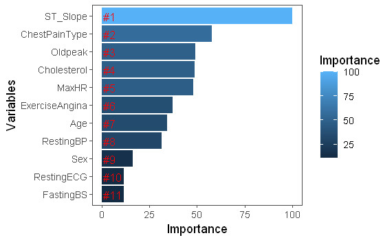
    ```

Biểu đồ chỉ ra biến ST_Slope có ảnh hưởng nhất đến khả năng mắc bệnh suy
tim trong tập dữ liệu.

# **7. Kết luận**

-   Về tổng quan, đề tài đã hoàn thành ở mức cơ bản, trả lời được những
    câu hỏi mà nhóm đã đặt ra với bộ dữ liệu.

-   Áp dụng được một số thuật toán đã học vào quá trình phân tích và
    nghiên cứu vấn đề.

-   Mô hình dự đoán suy tim sử dụng Logistic Regression cho ra kết quả
    với độ chính xác khá cao, có khi lên tới hơn 90% và hầu như là hơn
    80%.

-   Ngoài ra, thông qua các mô hình ta có thể thấy được nhịp tim lúc tập
    thể dục của người bị bệnh tim rất khác so với người không bị. Các
    chỉ số như độ trầm cảm, đau ngực do tập thể dục, các loại đau ngực,
    đường huyết lúc đói cũng ảnh hưởng tới khả năng bị bệnh tim.

-   Nếu có thêm thời gian hoặc nhiều tài nguyên tính toán hơn, nhóm em
    sẽ áp dụng thêm mô hình hồi quy tuyến tính (Linear Regression) vào
    đề tài để tiến hành phân tích một cách tốt hơn, chi tiết hơn những
    câu hỏi đã đặt ra. Thay đổi phương pháp chọn mẫu để có kết quả khách
    quan hơn và tìm ra thêm nhiều biến ẩn ảnh hưởng đến bệnh tim để kết
    quả cuối cùng có thể chính xác hơn.

# **8. Phụ lục**

# **9. Đóng góp**

-   Trần Tuyên Trường: Tìm hiểu ý nghĩa của các biến trong tập dữ liệu
    và nó liên quan như thế nào đến bệnh suy tim. Tìm hiểu lý do và phân
    tích ở câu hỏi nghiên cứu số 3:Trong các yếu tố ở dữ liệu, đâu là
    những yếu tố chính dẫn đến nguy cơ mắc bệnh tim suy tim cao hơn? Tìm
    hiểu các biểu đồ liên quan để phân tích và đưa ra kết quả sau khi
    giải quyết vấn đề. Tổng duyệt lại các file, các thư mục cần nộp.

-   Hoàng Uyên: Tìm hiểu, nghiên cứu câu hỏi đầu tiên Lượng Cholesterol
    cao ảnh hưởng như thế nào đến nguy cơ mắc bệnh tim? Tìm hiểu và vẽ
    các biểu đồ để phân tích và đưa ra kết quả chứng minh cho các nhận
    định nhìn ra.

-   Võ Hoàng Nguyên: Tìm hiểu, nghiên cứu câu hỏi 2: Nam giới có nguy cơ
    mắc bệnh tim cao hơn nữ giới hay không? Soạn nội dung cho file
    Report.rmd khi cả nhóm hoàn thành xong. Tìm hiểu và vẽ các biểu đồ
    để phân tích và đưa ra kết quả chứng minh cho các nhận định nhìn ra.
    Nghiên cứu và tìm hiểu cách thực hiện mô hình áp dụng cho câu hỏi.

-   Bùi Tấn Đạt: Tìm hiểu, nghiên cứu câu hỏi số 4: Sử dụng mô hình
    Logistic Regression để dự đoán một người có khả năng bị bệnh tim hay
    không? Kiểm tra tổng quát các biểu đồ mà nhóm đã vẽ. Tìm hiểu và vẽ
    các biểu đồ để phân tích và đưa ra kết quả chứng minh cho các nhận
    định nhìn ra trong câu hỏi cuối cùng. Soạn file Presentation.rmd
    bằng tiếng anh.

# **10. Tham khảo**

-   Giáo trình tham khảo của thầy trên trang dạy học số UTEX

-   Chanel Learn to do SCIENCE Link:[(1) Kiểm định t bằng R rất đơn giản
    \| Phân Tích Thống Kê 22 \| Learn to do SCIENCE -
    YouTube](https://www.youtube.com/watch?v=q5E-XV7clnY)

-   Data Science Basic, Hồi quy tuyến tính (linear regression) cho học
    máy (machine learning), 2021.
    Link:<https://datasciencebasic.com/?p=116>

-   By CHUA YI JIN, Heart Disease (GLM, SVM, RF),

    Link: [Heart Disease (GLM, SVM, RF) \|
    Kaggle](https://www.kaggle.com/code/jameaplays/heart-disease-glm-svm-rf)

-   Bevans, Linear Regression in R \| A Step-by-Step Guide &
    Examples, 2022.
    Link:<https://www.scribbr.com/statistics/linear-regression-in-r/>

-   By PAT NGUYEN, Predicting Customer Spend Link:[Predicting Customer
    Spend 💸🛒 \|
    Kaggle](https://www.kaggle.com/code/learnmoreaboutpat/predicting-customer-spend)

-   Pham Thi Hong Anh, Phân tích và trực quan hóa dữ liệu sử dụng ngôn
    ngữ R, 2021.
    <https://viblo.asia/p/phan-tich-va-truc-quan-hoa-du-lieu-su-dung-ngon-ngu-r-3Q75w6r2lWb>

-   Data Science Basic, Hồi quy tuyến tính (linear regression) cho học
    máy (machine learning), 2021. <https://datasciencebasic.com/?p=116>

-   Got It VietNam, Tìm hiểu Sigmoid Function và lịch sử hình thành của
    nó, 2021.

    <https://vn.got-it.ai/blog/tim-hieu-sigmoid-function-va-lich-su-hinh-thanh-cua-no>

-   Bác sĩ Võ Thành Nhân, Bệnh lý tim mạch: nguyên nhân gây tử vong hàng
    đầu

    <https://www.vinmec.com/vi/tim-mach/thong-tin-suc-khoe/benh-ly-tim-mach-nguyen-nhan-gay-tu-vong-hang-dau/#>

-   Tuấn Nguyễn, Random Forest algorithm, 2021.
    <https://machinelearningcoban.com/tabml_book/ch_model/random_forest.html>
